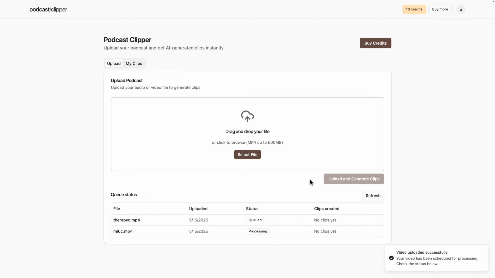
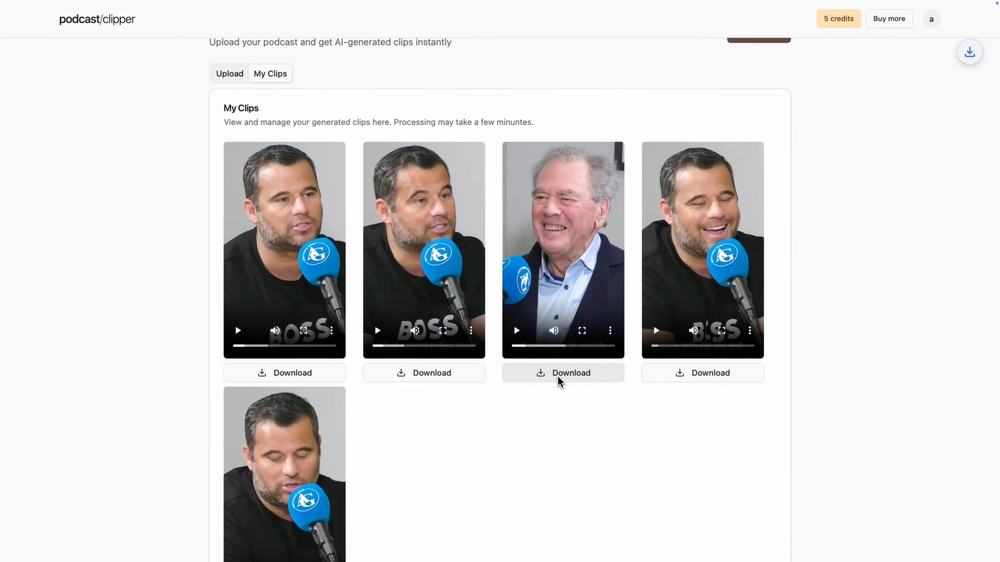

# **AI Podcast Clipper SaaS**

---

**AIPodcastClipperSaaS** is a full-stack AI-powered SaaS that converts long-form podcasts into viral short-form clips.
It uses **WhisperX** for transcription, **Gemini Pro** for moment detection, **LR-ASD** for speaker detection, and **FFMPEG** for clip rendering.
**Built with:** Next.js 15, TypeScript, Tailwind CSS, ShadCN, Python, FastAPI, Stripe, Modal, Inngest, AWS S3, and more.

---

## **FEATURES**

---

* WhisperX transcription
* LR-ASD speaker detection
* Clip rendering with FFMPEGCV
* LLM-powered moment detection with Gemini 2.5 Pro
* Stripe credit system
* Auth.js authentication
* Inngest background job queues
* Modal serverless GPU compute
* Responsive dashboard for upload and preview
* Vertical mobile-optimized output

---

## **SCREENSHOTS**

---

### Podcast Upload Page



### Clips Generated Page



---

## **CLONE REPOSITORY**

---

```bash
git clone --recurse-submodules https://github.com/AmayTrip29/AIPodcastClipperSaaS.git
````

---

## **BACKEND SETUP**

---

```bash
cd AIPodcastClipperSaaS/ai-podcast-clipper-backend
```

**Create Python 3.12 virtual environment**

```bash
python -m venv venv
.\venv\Scripts\activate
```

**Install backend dependencies**

```bash
pip install -r requirements.txt
```

**Clone LR-ASD for speaker detection**

```bash
git clone https://github.com/Junhua-Liao/LR-ASD.git asd
```

**Set up Modal for serverless GPU functions**

```bash
modal setup
```

**Run backend locally on Modal**

```bash
modal run main.py
```

**Deploy backend to Modal**

```bash
modal deploy main.py
```

---

## **FRONTEND SETUP**

---

```bash
cd ../ai-podcast-clipper-frontend
```

**Install frontend dependencies**

```bash
npm install
```

**Start frontend development server**

```bash
npm run dev
```

---

## **QUEUE SERVER (INNGEST)**

---

**Start local queue server with Inngest**

```bash
npm run inngest-dev
```

---

## **AWS S3 SETUP - CORS POLICY**

---

Apply this **CORS configuration** to your S3 bucket:

```json
[
    {
        "AllowedHeaders": [
            "Content-Type",
            "Content-Length",
            "Authorization"
        ],
        "AllowedMethods": [
            "PUT"
        ],
        "AllowedOrigins": [
            "*"
        ],
        "ExposeHeaders": [
            "ETag"
        ],
        "MaxAgeSeconds": 3600
    }
]
```

---

## **AWS S3 SETUP - IAM POLICY**

---

Use this **IAM policy** for upload/download access:

```json
{
    "Version": "2012-10-17",
    "Statement": [
        {
            "Effect": "Allow",
            "Action": [
                "s3:ListBucket"
            ],
            "Resource": "[S3 ARN here]"
        },
        {
            "Effect": "Allow",
            "Action": [
                "s3:GetObject",
                "s3:PutObject"
            ],
            "Resource": "[S3 ARN here]/*"
        }
    ]
}
```

---

## **LLM SETUP - GEMINI API KEY**

---

Go to: [Gemini API Quickstart](https://ai.google.dev/gemini-api/docs/quickstart?lang=python)
Generate an API key and add it to your backend environment file.

---

## **DONE**

---

The **AIPodcastClipperSaaS** app is now ready to run and develop.

---